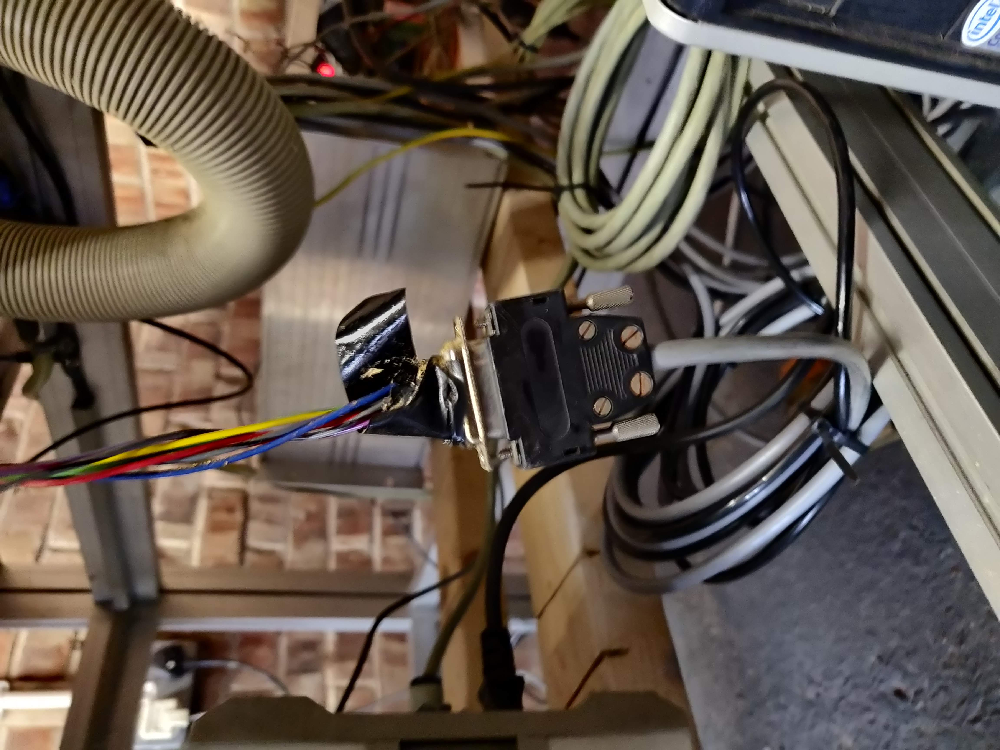
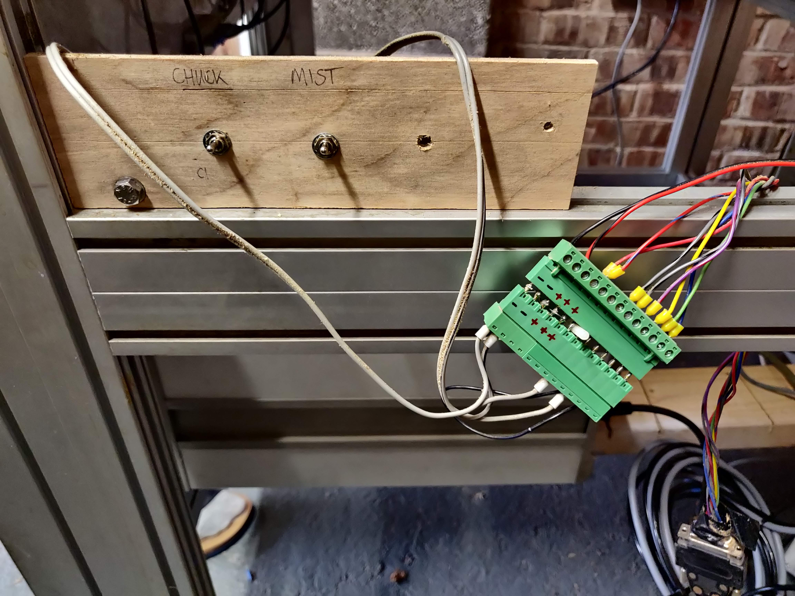

# Datron_CNC
Custom Datron CNC configuration

### [Images](./images/README.md)

### Abbreviations

 * TC Tool change
 * AB Air Blast
 * Left mist?
 * Right mist

### Solenoid Valve white connector

|'White' pin|Wire colour|'D' pin|Function|
|-----------|-----------|-------|--------|
| 1         |Blue       |  9    |Common  |
| 2         |Pink       | 11    |+ AB L  |
| 3         |Mauve      |  7    |  TC R  |
| 4         |Yellow     | 14    |Left R  |
| 5         |Black      | 10    |  AL R  |
| 6         |Grey/Pink  |  3    |  "" "  |
| 7         |Green      |  5    |  AR L  |
| 8         |Brown      |  1    |  "" "  |
| 9         |Grey       | 12    |Right R |
|10         |White      |  8    |  AB R  |

## Not sure what these are (taken from sketch)
## Solenoid D connector to Green / interface key

|          |         |     |
|----------|---------|-----|
|Grey      | TC      | -ve |
|          |         |     |
|Red       | 24v     | +ve |
|Red/Blue  | 24v     | +ve |
|          |         |     |
|Yellow    | AL      | -ve |
|Green     | AR      | -ve |
|Blue      |Air Blast| -ve |
|          |         |     |
|Grey/Black| L       | -ve |
|Purple/Red| R       | -ve |
|          |         |     |
|Black     | 0v      | -ve |

## Solenoid Valve D Connector

<td valign="bottom">
 
IMG_20230804_083237.jpg
</td>

|    |    |      |
|----|----|------|
|  1 | j5 | 1.8R |
|  2 |    | n/c  |
|  3 | j10| 1.3R |
|  4 |    | n/c  |
|  5 | j1 |      |
|  6 |    | n/c  |
|  7 |    | n/c  |
|  8 |    | 540R |
|  9 |    |Common|
| 10 | j3 |      |
| 11 |    | n/c  |
| 12 |    | 553R |
| 13 |    | n/c  |
| 14 |    | 552R |
| 15 |    |      |

## Green connectors and switches

<td valign="bottom">
 
IMG_20230804_083251.jpg
</td>

|  #  | Label| LR wire             | RH wire     |Function  |
|-----|------|---------------------|-------------|----------|
| 1   | -ve  | Red                 |TC switch com|Common -ve|
| 2   | -ve  | n/c                 |AB switch com|Common -ve
| 3   | +ve  | Black               |24 volt input|        |
| 4   | +ve  | n/c                 |             |        |
| 5   | +ve  | Red/Blue, Red/Orange|24 Volt fused|+ve     |
| 6   |      | n/c                 |             |        |
| 7   |      | n/c                 |             |        |
| 8   |      | grey/black          |black to 12  |L       |
| 9   |      | grey/black          |             |Right R |
| 10  |      | mauve/blue          |             |TC R    |
| 11  |      | yellow              |black to 8   |Left R  |
| 12  |      | green               |             |AR L    |
| 13  |      | blue                |             |Common  |

## Interface circuits and power supply

<td valign="bottom">
 
IMG_20230804_083301.jpg
</td>

